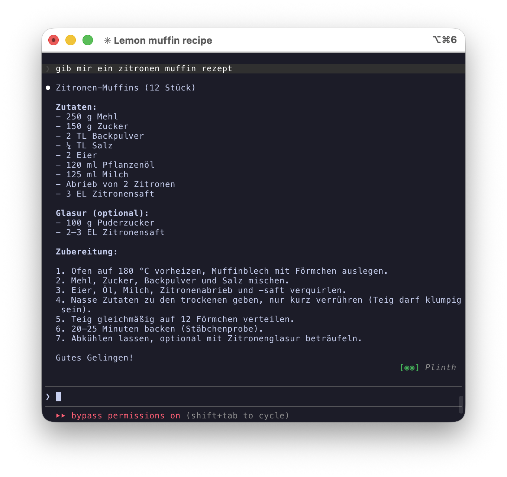
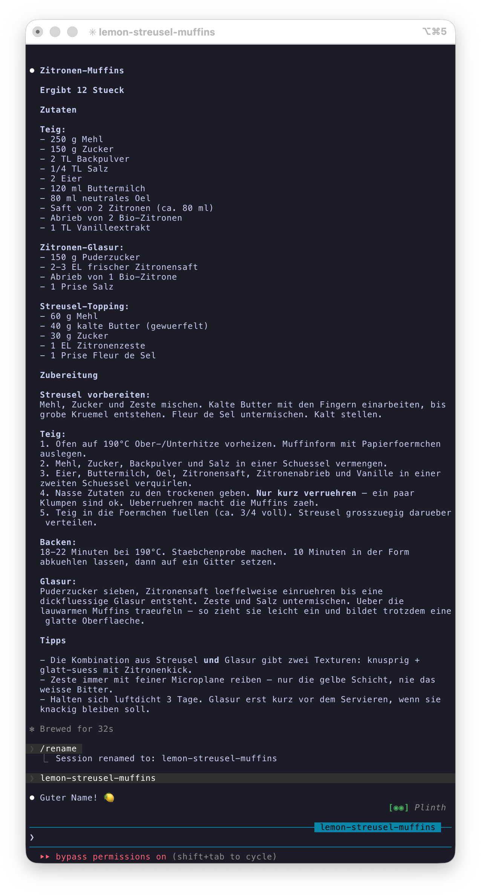

# Prompt Refiner

Rate what matters before Claude responds. 4 dimensions, 4 keystrokes, better output.

## Install

```
/plugin marketplace add Heinrichs-Heinrichs/prompt-refiner
/plugin install prompt-refiner@prompt-refiner
```

## Command

### `/refine`

Identifies ambiguous dimensions in your prompt and lets you rate their importance before Claude responds.

**Usage:**

```
/refine <your prompt>
```

**Example:**

```
/refine give me a lemon muffin recipe
```

Claude shows 4 dimensions. You rate each with a single keypress:

```
  ┌ Effort   Glaze   Texture   Lemon   Submit ┐

  Effort — Simple vs. elaborate?
  1. not relevant      Skip
  2. don't care        AI decides        ← you pick this
  3. relevant          Handle carefully
  4. very important    Top priority
```

**Without /refine:**



**With /refine** — after rating Glaze and Lemon as "very important":



Same prompt. 4 keystrokes. The dimensions you cared about got depth.

## The Scale

| Key | Level | What it tells Claude |
|-----|-------|---------------------|
| 1 | not relevant | Guardrail — skip this entirely |
| 2 | don't care | Freedom — AI decides (this is the most useful option) |
| 3 | relevant | Handle with care |
| 4 | very important | Top priority — maximum effort |

## How It Works

1. You type `/refine <prompt>`
2. Claude identifies 4 ambiguous dimensions in your prompt
3. You rate each with a single keypress (1-4)
4. Claude responds with your priorities baked in — without mentioning them

No API keys. No dependencies. The entire plugin is one markdown file that uses Claude's built-in `AskUserQuestion` tool.

## License

MIT — [Heinrichs & Heinrichs](https://github.com/Heinrichs-Heinrichs)
